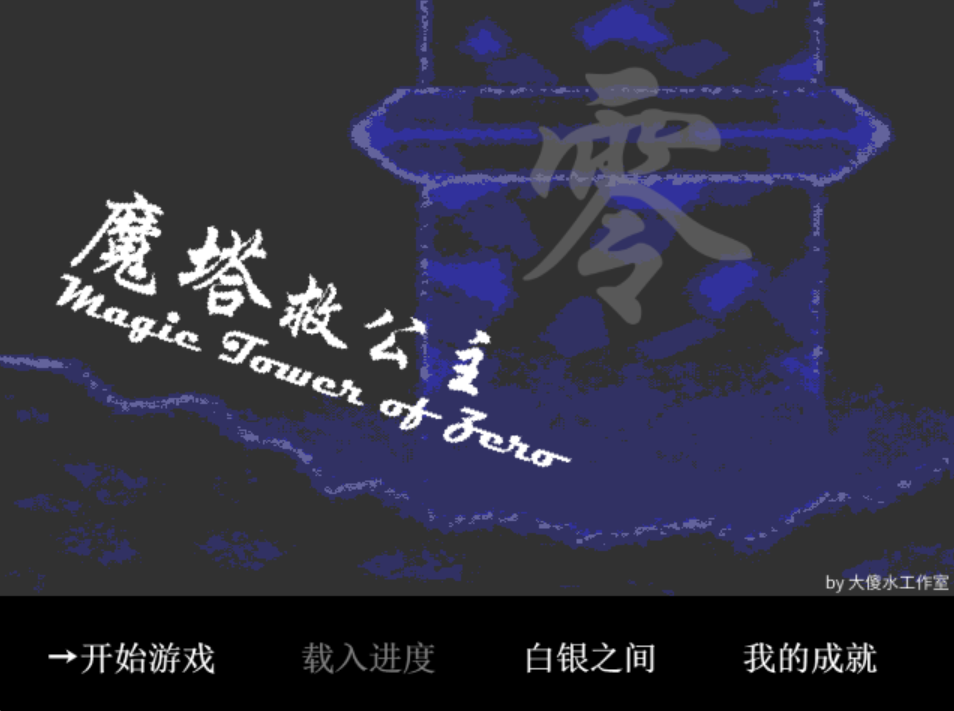
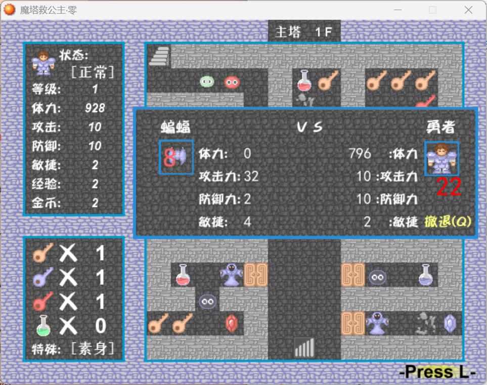
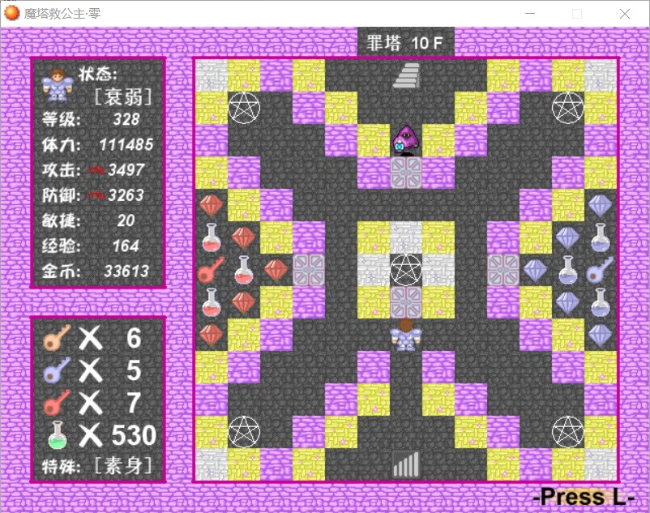

# 魔塔救公主·零

**《魔塔救公主·零》**，又名“魔塔救公主零”(有时会被称为90)

## 游戏介绍
这里是由大傻水工作室制作的魔塔救公主·零。
游戏由RPG MAKER XP制作，在脚本制作上尽可能地模仿了新新魔塔的特征，同时进行了自己的创新。
主要玩法为石像玩法，在游戏中有十种不同的石像，其中五种为主动石像，另五种为被动石像，使用不同的组合能够发挥出其不意的效果。
游戏在剧情上分为一二周目，目前发布版本仅提供一周目的剧情游玩方式，二周目会在不久后发布。
项目文件夹内存在游戏说明，里面会对游戏中出现的角色以及怪物的相关信息有详细介绍。

## 下载游戏

- [下载《魔塔救公主·零》最新版本](https://github.com/BenJoang/Mota-save-princess-zero/releases/latest)

下载后：

1. 下载对应版本的游戏压缩包；
2. 将压缩包完整解压到一个单独的文件夹；
3. 根据要求安装对应字体，根据压缩包内的文件启动游戏；
4. 请不要直接在压缩软件中运行游戏。

建议优先下载标记为 Latest 的最新正式版本。

## 合作者
本魔塔由大傻水工作室的各位合作完成

[@BenJoang](https://github.com/BenJoang): 大傻水，负责本魔塔的核心代码编写，包括战斗、行动以及地图内交互控制。

@大傻E：大傻E，b站空间[@卡路十里](https://space.bilibili.com/200729395)。该塔主要牵头制作者，负责地图绘制、石像技能设计、怪物属性设计以及剧情编写。

@可酌：可酌，负责白银之间相关核心代码编写。

@六级：六级，负责测试以及相关楼层传送代码编写。

@冻手：冻手，负责测试。

@盐铁桶子：盐铁桶子，b站空间[@盐铁桶子](https://space.bilibili.com/8183775)，进行了测试并提供了宝贵测试意见。[相关游戏视频可点击此处。](https://www.bilibili.com/video/BV1NR6JYuESB/?)

感谢游玩《魔塔救公主·零》。

也欢迎通过 Issues 提交 Bug、建议和游玩反馈。

## 游戏截图

## 版权声明

Copyright © 2025–2026 [大傻水（BenJoang）](https://github.com/BenJoang). All rights reserved except as expressly permitted under the PolyForm Noncommercial License 1.0.0.